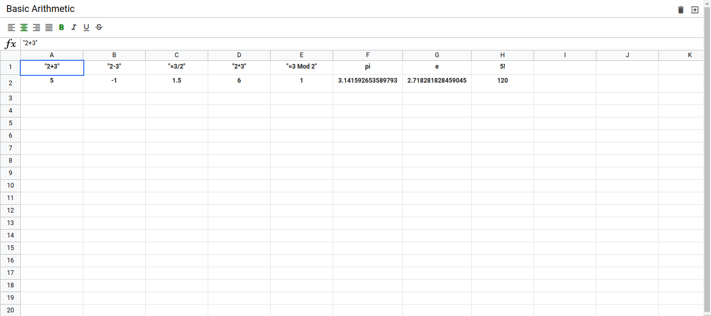

# My Excel-Like JavaScript Spreadsheet

Welcome to my personal JavaScript spreadsheet project. If you're tired of heavyweight spreadsheet software, this might be just what you need.

## Overview

This project is all about providing a powerful yet lightweight solution for handling data. It's like having an Excel-like experience right in your browser.

- **Excel-Like Feel**: If you're familiar with Excel, you'll feel right at home here. The interface is designed to be intuitive and user-friendly.

- **Hash Routing**: Easy navigation is a must, so I've implemented hash routing to help you seamlessly move between different sections of your spreadsheet.

- **Math Expression Parsing**: Need to do some math? No problem! Just start your expression with "=" like you would in Excel, and watch as the results update in real-time.

- **Sheet Management**: Keep your projects organized by creating, naming, or removing sheets. No more cluttered data!

- **Cell Range Selection**: Selecting cells as a range (matrix) is a breeze. This makes data manipulation super convenient.

- **Text Formatting**: Customize the appearance of your data with options like text alignment and decoration (bold, italic, underline, and more).

- **Local Storage**: Worried about losing your work? Don't be! Your data is safely stored in local storage, so you can pick up where you left off, even if you accidentally close your browser.

- **Lightweight**: I've kept dependencies to a minimum. I use `core-js` for polyfilling, `normalize.css` for consistent styling, and `math-expression-evaluator` for safe expression evaluation.

## Getting Started

Getting started is a piece of cake:

1. Clone this repository to your computer.
1. Install dependencies `npm i`
1. Run the dev server or make build and open it `npm run dev:server / npm run build`
2. Open the project in your web browser.
3. Start creating sheets.

## Usage

Using my JavaScript spreadsheet is a breeze! Here's a quick example of how you can create a simple Excel-like formula:

1. Click on a cell.
2. Start your expression with "=" (e.g., "=A1+B1").
3. Watch as the result magically appears in the cell.

## Screenshots

Take a peek at my project in action:

*Basic Arithmetic*

*Logarithmic Function*

*Main Spreadsheet View*

*Trigonometric Functions*

## Dependencies

My project relies on a few key dependencies:

- `core-js`: I use this for polyfilling to ensure compatibility with various browsers.

- `normalize.css`: It provides consistent styling across different browsers and devices.

- `math-expression-evaluator`: This handy tool enables safe evaluation of mathematical expressions entered by users.

## Contributing

I'm all ears for contributions from the community! Whether it's bug reports, feature requests, or even code contributions, your input is valuable.

## License

This project is licensed under the MIT License - see the [LICENSE](LICENSE) file for all the legal stuff.

---

Thank you for checking out my Excel-Like JavaScript Spreadsheet project. It's all about learning, experimenting, and having fun with data. If you have any questions or ideas, feel free to reach out or open an issue on GitHub.

Happy spreadsheet adventures! 📊📈
